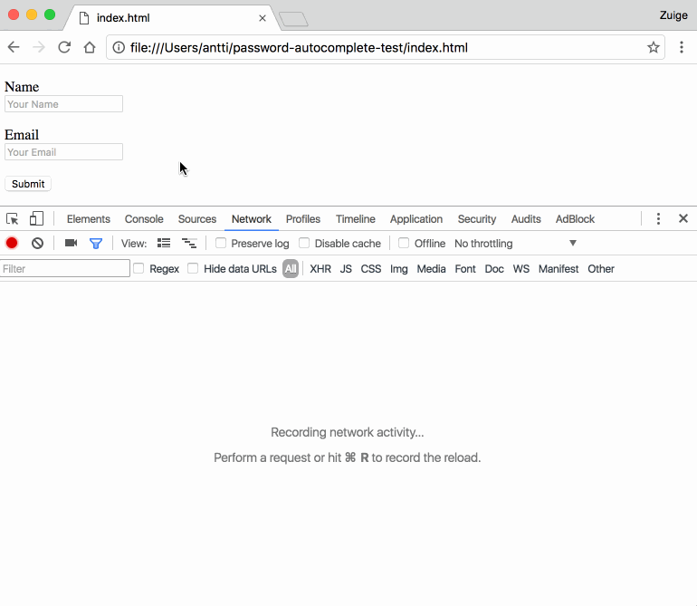

# Browser Autofill Phishing 
This tool ia based on [Browser Autofill Phishing](https://github.com/anttiviljami/browser-autofill-phishing).
This is a simple demonstration of form fields hidden from the user, but will be
filled anyways when using the browser form autofill feature, which poses a
security risk for users, unaware of giving their information to the website.

## Google Chrome behaviour

Here's the demo in action on the Google Chrome Browser:

## Other browsers

It works differently in some other browsers. For example:

* In Safari, it will tell you all the data it is filling into the form, even
  if it isn't visible to you.

* In Firefox, you have to right click an input field and then select an
  identity to use. So a Firefox user autofills each field.

## Live demo

View the page at:
[https://faizan-khanx.github.io/AutoFill-Investigation/](https://faizan-khanx.github.io/AutoFill-Investigation/)

## Contributing

Please feel free to submit pull requests to this repository for any additional
information you feel is important!

  
